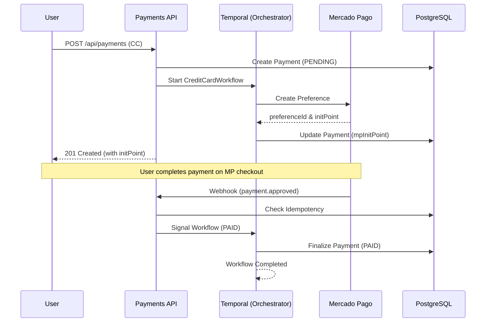

# 🏦 Payments API

A production-ready **payment orchestration service** built with **NestJS**, **PostgreSQL**, **Mercado Pago**, and **Temporal.io**.

This API is responsible for managing **PIX** and **Credit Card** payment lifecycles with strong guarantees of **consistency**, **idempotency**, and **resilience**.  
Long-running payment processes are orchestrated using **Temporal.io**, ensuring that no transaction is lost even in the presence of failures, retries, or service restarts.

---

## 🎯 Problem This Project Solves

Payment systems operate in an unreliable environment:

- External gateways may be slow or unavailable
- Webhooks can be delayed, duplicated, or arrive out of order
- Services may crash mid-transaction
- User flows span minutes or hours, not milliseconds

This project addresses these challenges by combining:

- Explicit business use cases
- Infrastructure-agnostic domain logic
- Deterministic orchestration with Temporal
- Strict webhook idempotency

---

## 🧱 Architectural Design

This project adopts a **Clean, Modular, Use-Case-Driven Architecture**, inspired by:

- Clean Architecture
- Ports & Adapters (Hexagonal Architecture)
- Explicit Application Use Cases
- Eventual Consistency with Workflow Orchestration

The architecture is expressed **directly through the folder structure**, not only by documentation.

---

## 📦 Module Structure

All business logic related to payments lives under:

```
src/modules/payments
```

Each subfolder has a **single, clear responsibility**.

---

### 🟦 domain/ — Business Rules

- Pure business concepts
- No framework, database, or HTTP dependencies
- Represents the ubiquitous language of the payment domain

---

### 🟨 application/ — Application Use Cases

Defines what the system does.

- One use case per business action
- Fully isolated from infrastructure
- Unit-test friendly

---

### 🟥 infra/ — Infrastructure Adapters

Contains technical implementations:

- Prisma repositories
- Mercado Pago gateway
- Persistence mappers

Can be replaced without impacting business rules.

---

### 🟪 presentation/ — API Layer

- HTTP controllers
- DTO validation
- Request/response mapping
- No business logic

---

### ⏱ temporal/ — Workflow Orchestration

- Long-running processes
- Deterministic workflows
- Activities delegate to application use cases

---

### 🔄 System Flow (Credit Card)



---

## 🚀 Getting Started

### 📋 Prerequisites

- **Node.js** (v18+)
- **Docker & Docker Compose**
- **npm** (v9+)

### 🛠️ Installation & Setup

1. **Clone & Install**

   ```bash
   git clone <repository-url>
   cd payments-api
   npm install
   ```

2. **Configuration**
   Copy the environment template:

   ```bash
   cp .env.example .env
   ```

3. **Exposing for Webhooks (Required for real MP testing)**
   Mercado Pago needs to reach your local environment to send webhook notifications.

   ```bash
   # Using ngrok
   ngrok http 3000
   ```

   Update your `.env` with your Mercado Pago Access Token and the generated ngrok URL:

   ```env
   # Mercado Pago Credentials
   MERCADOPAGO_ACCESS_TOKEN=APP_USR-your-token-here

   # Webhook Notification (The most important for background updates)
   MERCADOPAGO_NOTIFICATION_URL=https://your-id.ngrok-free.app/api/webhooks/mercadopago

   # Checkout Redirects (Mandatory for Credit Card flow)
   MERCADOPAGO_SUCCESS_URL=https://your-id.ngrok-free.app/payments/success
   MERCADOPAGO_FAILURE_URL=https://your-id.ngrok-free.app/payments/failure
   MERCADOPAGO_PENDING_URL=https://your-id.ngrok-free.app/payments/pending
   ```

   _Note: These URLs are required by the Mercado Pago API to redirect the user after the payment attempt and to send asynchronous notifications._

---

## 🛰️ Running the Project

### Option A: The "One Command" Start (Docker)

This starts the API, PostgreSQL, Temporal Server, and the Temporal Worker.

```bash
docker compose up -d --build
```

- **API**: `http://localhost:3000`
- **Swagger Docs**: `http://localhost:3000/api/docs`
- **Temporal UI**: `http://localhost:8080` (Monitor your workflows here!)

### Option B: Local Development

```bash
# Terminal 1: Application
npm run start:dev

# Terminal 2: Temporal Worker
npm run temporal:worker
```

---

## 🧪 Testing Suite

The project maintains high reliability through a comprehensive test suite.

### 🧪 Unit Tests

Focuses on business rules and use cases.

```bash
npm run test:unit
```

### 🧪 E2E Tests (Integration)

Validates the full API + DB flow. **Note**: These tests run deterministically without needing a real Temporal server running by using an internal fallback flag (`TEMPORAL_ENABLED=false`).

```bash
npm run test:e2e:run
```

---

## 🕹️ Manual Testing Guide (E2E)

### 1. Create a Credit Card Payment

```bash
curl -X POST http://localhost:3000/api/payments \
  -H "Content-Type: application/json" \
  -d '{
    "amount": 250.00,
    "description": "Premium License",
    "payerCpf": "11144477735",
    "paymentMethod": "CREDIT_CARD"
  }'
```

### 2. Complete the Payment (Real Flow)

The previous request returns an `mpSandboxInitPoint` (or `mpInitPoint`).

- **Open the URL** in your browser.
- **Complete the checkout** on the Mercado Pago page.
- Once finished, Mercado Pago will automatically call your webhook (if ngrok is running and configured), and the Temporal workflow will finalize the status to `PAID`.

---

### 3. Monitor the Orchestration

Visit the **Temporal UI** (`http://localhost:8080`). You will see a workflow named `payment-<externalReference>` in `Running` state. If you followed the real flow above, you will see it transition to `Completed` automatically after the payment.

---

### 4. Simulate Mercado Pago Webhook (Shortcut)

If you are **not** using ngrok or don't want to perform the real checkout, you can simulate the webhook call manually:

```bash
curl -X POST http://localhost:3000/api/webhooks/mercadopago \
  -H "Content-Type: application/json" \
  -d '{
    "type": "payment",
    "data": { "id": "real-mp-id-001" }
  }'
```

---

### 5. Verify Final State

```bash
curl http://localhost:3000/api/payments/<id>
```

_Expected Status: `PAID`._

---

## 🛡️ Key Features & Implementation Details

- **Clean Architecture**: Boundaries enforced between layers.
- **Temporal.io Orchestration**: Ensures that even if the server crashes after a payment is authorized on the gateway, the system will eventually catch up and update the database.
- **Idempotent Webhooks**: We use a `WebhookEvent` table to ensure that re-sent notifications from Mercado Pago do not trigger duplicate business logic.
- **Swagger Documentation**: Self-documenting API available at `/api/docs`.
- **Workflow Determinism**: Automated checks to ensure workflows comply with Temporal's execution constraints (`npm run temporal:check-workflows`).

---

## 📜 Scripts Reference

| Script                    | Action                                        |
| ------------------------- | --------------------------------------------- |
| `npm run start:dev`       | Start API in watch mode                       |
| `npm run temporal:worker` | Start the background job processor            |
| `npm run test:e2e:run`    | Spin up test DB, run migrations and E2E tests |
| `npm run prisma:generate` | Update Prisma Client types                    |
| `npm run build`           | Production build                              |

---

**Payments API** | Made with ❤️ by Alisson Luan


