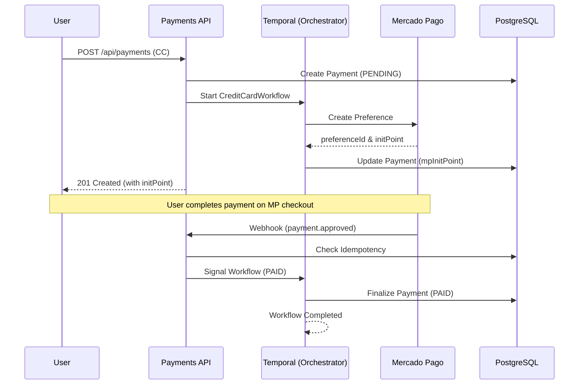

# 🏦 Payments API

A robust, production-ready **payment orchestration service** built with **NestJS**, **PostgreSQL**, **Mercado Pago**, and **Temporal.io**.

This API orchestrates **PIX** and **Credit Card** payment lifecycles with strong guarantees around **resilience**, **idempotency**, and **eventual consistency**.  
Long-running payment processes are coordinated using **Temporal.io**, ensuring payments are not lost even in the presence of retries, webhook duplication, and service restarts.

---

## 🎯 What This Solves

Payments happen in an unreliable environment:

- Gateways can be slow / fail intermittently
- Webhooks can be delayed, duplicated, or arrive out of order
- A payment may complete minutes after the initial request
- Services can crash mid-flow

This project addresses those issues by combining:

- **Use-case driven application layer** (explicit business actions)
- **Ports & adapters** (infrastructure can change without rewriting business rules)
- **Temporal orchestration** (durable long-running coordination)
- **Webhook idempotency** (safe retries without double-processing)

---

## 🧱 Architecture (Applied, Not Buzzwords)

This repository uses a **Clean, Modular, Use-Case-Driven** structure. The architecture is reflected by the folder layout, so boundaries are clear and enforceable.

### 📦 Folder Layout (Payments Module)

All payment business logic is contained under:

```text
src/modules/payments
```

#### `domain/` — business rules
- Entities, value objects, enums
- No NestJS, no Prisma, no HTTP, no SDK imports
- Represents the ubiquitous language of the payment domain

#### `application/` — what the system does
- **Use cases** (one file = one business capability)
- **Ports** (interfaces/contracts for repositories, gateways, orchestration)

> This layer must not depend on database, HTTP controllers, or Mercado Pago SDK specifics.

#### `infra/` — how the system does it
- Prisma repositories and persistence mapping
- Mercado Pago gateway adapter
- Anything technical that can change without touching use cases

#### `presentation/` — API boundary
- Controllers, DTOs, request/response mapping, validation
- No business rules here (only orchestration of inputs/outputs)

### ⏱ Temporal Integration

Temporal is treated as an **orchestration layer**, not a place for business rules.

- **Workflows** coordinate long-running payment states
- **Activities** delegate execution to application use cases / ports
- Workflows remain deterministic and replay-safe

---

## 🔄 System Flow (Credit Card)



---

## 🚀 Getting Started

### 📋 Prerequisites

- **Node.js** (v18+)
- **Docker & Docker Compose**
- **npm** (v9+)

### 🛠️ Installation & Setup

1. **Clone & Install**

   ```bash
   git clone <repository-url>
   cd payments-api
   npm install
   ```

2. **Configuration**
   Copy the environment template:

   ```bash
   cp .env.example .env
   ```

3. **Exposing for Webhooks (Required for real MP testing)**

   Mercado Pago needs to reach your local environment to send webhook notifications.

   ```bash
   # Using ngrok
   ngrok http 3000
   ```

   Update your `.env` with your Mercado Pago Access Token and the generated ngrok URL:

   ```env
   # Mercado Pago Credentials
   MERCADOPAGO_ACCESS_TOKEN=APP_USR-your-token-here

   # Webhook Notification (Required for background updates)
   MERCADOPAGO_NOTIFICATION_URL=https://your-id.ngrok-free.app/api/webhooks/mercadopago

   # Checkout Redirects (Mandatory for Credit Card flow)
   MERCADOPAGO_SUCCESS_URL=https://your-id.ngrok-free.app/payments/success
   MERCADOPAGO_FAILURE_URL=https://your-id.ngrok-free.app/payments/failure
   MERCADOPAGO_PENDING_URL=https://your-id.ngrok-free.app/payments/pending
   ```

   **Important:**
   - `MERCADOPAGO_NOTIFICATION_URL` must be reachable by Mercado Pago, otherwise status updates won’t arrive.
   - The `SUCCESS/FAILURE/PENDING` URLs are required by Mercado Pago for checkout redirects.

---

## 🛰️ Running the Project

### Option A: The "One Command" Start (Docker)

This starts the API, PostgreSQL, Temporal Server, and the Temporal Worker.

```bash
docker compose up -d --build
```

- **API**: `http://localhost:3000`
- **Swagger Docs**: `http://localhost:3000/api/docs`
- **Temporal UI**: `http://localhost:8080` (Monitor workflows here)

### Option B: Local Development

```bash
# Terminal 1: Application
npm run start:dev

# Terminal 2: Temporal Worker
npm run temporal:worker
```

---

## 🧪 Testing Suite

The project maintains reliability through a comprehensive test suite.

### 🧪 Unit Tests

Focus on business rules and use cases.

```bash
npm run test:unit
```

### 🧪 E2E Tests (Integration)

Validates the full API + DB flow.

**Note:** these tests run deterministically without requiring a real Temporal server, using an internal fallback flag:

- `TEMPORAL_ENABLED=false`

```bash
npm run test:e2e:run
```

---

## 🕹️ Manual Testing Guide (E2E)

### 1. Create a Credit Card Payment

```bash
curl -X POST http://localhost:3000/api/payments \
  -H "Content-Type: application/json" \
  -d '{
    "amount": 250.00,
    "description": "Premium License",
    "payerCpf": "11144477735",
    "paymentMethod": "CREDIT_CARD"
  }'
```

### 2. Complete the Payment (Real Flow)

The previous request returns an `mpSandboxInitPoint` (or `mpInitPoint`).

- **Open the URL** in your browser.
- **Complete the checkout** on the Mercado Pago page.
- Once finished, Mercado Pago will automatically call your webhook (if ngrok is running and configured), and the Temporal workflow will finalize the status to `PAID`.

---

### 3. Monitor the Orchestration

Visit the **Temporal UI** (`http://localhost:8080`). You will see a workflow named `payment-<externalReference>` in `Running` state.  
If you followed the real flow above, you will see it transition to `Completed` automatically after the payment.

---

### 4. Simulate Mercado Pago Webhook (Shortcut)

If you are **not** using ngrok or don't want to perform the real checkout, you can simulate the webhook call manually:

```bash
curl -X POST http://localhost:3000/api/webhooks/mercadopago \
  -H "Content-Type: application/json" \
  -d '{
    "type": "payment",
    "data": { "id": "real-mp-id-001" }
  }'
```

---

### 5. Verify Final State

```bash
curl http://localhost:3000/api/payments/<id>
```

_Expected Status: `PAID`._

---

## 🛡️ Key Features & Implementation Details

- **Use-case driven design**: business actions live in the application layer (testable in isolation).
- **Temporal orchestration**: durable coordination for long-running payment lifecycles.
- **Idempotent webhooks**: a `WebhookEvent` table guarantees safe retry handling.
- **Swagger docs**: available at `/api/docs`.
- **Workflow determinism checks**: `npm run temporal:check-workflows`.

---

## 📜 Scripts Reference

| Script                    | Action                                        |
| ------------------------- | --------------------------------------------- |
| `npm run start:dev`       | Start API in watch mode                       |
| `npm run temporal:worker` | Start the background job processor            |
| `npm run test:e2e:run`    | Spin up test DB, run migrations and E2E tests |
| `npm run prisma:generate` | Update Prisma Client types                    |
| `npm run build`           | Production build                              |

---

**Payments API** | Made with ❤️ by Alisson Luan
