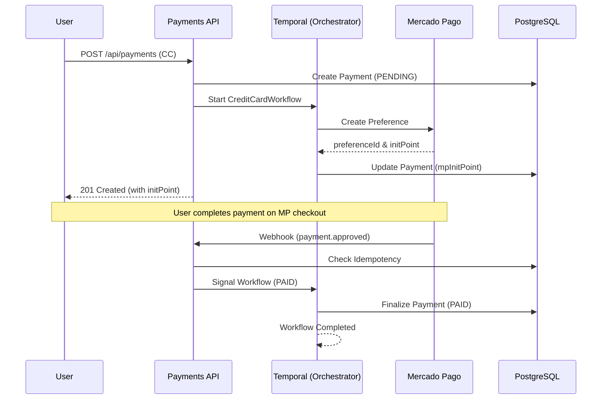

# 🏦 Payments API

A robust, production-ready **payment orchestration service** built with **NestJS**, **PostgreSQL**, **Mercado Pago**, and **Temporal.io**.

This API orchestrates **PIX** and **Credit Card** payment lifecycles with strong guarantees around **resilience**, **idempotency**, and **eventual consistency**.  
Long-running payment processes are coordinated using **Temporal.io**, ensuring payments are not lost even in the presence of retries, webhook duplication, and service restarts.

---

## 🎯 What This Solves

Payments happen in an unreliable environment:

- Gateways can be slow / fail intermittently
- Webhooks can be delayed, duplicated, or arrive out of order
- A payment may complete minutes after the initial request
- Services can crash mid-flow

This project addresses those issues by combining:

- **Use-case driven application layer** (explicit business actions)
- **Ports & adapters** (infrastructure can change without rewriting business rules)
- **Temporal orchestration** (durable long-running coordination)
- **Webhook idempotency** (safe retries without double-processing)

---

## 🧱 Architecture (Applied, Not Buzzwords)

This repository uses a **Clean, Modular, Use-Case-Driven** structure. The architecture is reflected by the folder layout, so boundaries are clear and enforceable.

### 📦 Folder Layout (Payments Module)

All payment business logic is contained under:

```text
src/modules/payments
```

#### `domain/` — business rules
- Entities, value objects, enums
- No NestJS, no Prisma, no HTTP, no SDK imports
- Represents the ubiquitous language of the payment domain

#### `application/` — what the system does
- **Use cases** (one file = one business capability)
- **Ports** (interfaces/contracts for repositories, gateways, orchestration)

> This layer must not depend on database, HTTP controllers, or Mercado Pago SDK specifics.

#### `infra/` — how the system does it
- Prisma repositories and persistence mapping
- Mercado Pago gateway adapter
- Anything technical that can change without touching use cases

#### `presentation/` — API boundary
- Controllers, DTOs, request/response mapping, validation
- No business rules here (only orchestration of inputs/outputs)

### ⏱ Temporal Integration

Temporal is treated as an **orchestration layer**, not a place for business rules.

- **Workflows** coordinate long-running payment states
- **Activities** delegate execution to application use cases / ports
- Workflows remain deterministic and replay-safe

---

## 📐 Business Rules

- A payment is created with initial status `PENDING`
- Only final states are allowed via manual update:
  - `PAID`
  - `FAIL`
- Webhooks are idempotent and cannot transition a finalized payment
- A payment lifecycle is owned by a single Temporal workflow
- Manual updates do not bypass idempotency or workflow finalization rules

## 🔄 System Flow (Credit Card)



---

## 🚀 Getting Started

### 📋 Prerequisites

- **Node.js** (v18+)
- **Docker & Docker Compose**
- **npm** (v9+)

### 🛠️ Installation & Setup

1. **Clone & Install**

   ```bash
   git clone <repository-url>
   cd payments-api
   npm install
   ```

2. **Configuration**
   Copy the environment template:

   ```bash
   cp .env.example .env
   ```

3. **Exposing for Webhooks (Required for real MP testing)**

   Mercado Pago needs to reach your local environment to send webhook notifications.

   ```bash
   ngrok http 3000
   ```

---

## 🛰️ Running the Project

### Option A: Docker

```bash
docker compose up -d --build
```

### Option B: Local

```bash
npm run start:dev
npm run temporal:worker
```

---

## 📡 API Endpoints (Payments)

### Routes Summary

| Method | Route | Description |
|------:|------|-------------|
| POST | /api/payments | Create a payment |
| GET | /api/payments | List payments (query filters) |
| GET | /api/payments/:id | Get payment by id |
| PUT | /api/payments/:id | Update payment (final states only) |

---

### 🔎 Get Payment By ID

```bash
curl http://localhost:3000/api/payments/<id>
```

---

### 📄 List Payments (Query Params)

Supported query params:
- `payerCpf`
- `paymentMethod`

```bash
curl "http://localhost:3000/api/payments?payerCpf=11144477735&paymentMethod=PIX"
```

---

### ✏️ Update Payment

Allowed updates:
- `amount`
- `description`
- `status` (only `PAID` or `FAIL`)

```bash
curl -X PUT http://localhost:3000/api/payments/<id>   -H "Content-Type: application/json"   -d '{ "status": "PAID" }'
```

---

## 📜 Scripts Reference

| Script | Action |
|------|--------|
| npm run start:dev | Start API |
| npm run temporal:worker | Start worker |
| npm run test:e2e:run | Run E2E tests |
| npm run build | Production build |

---

**Payments API** | Made with ❤️ by Alisson Luan

